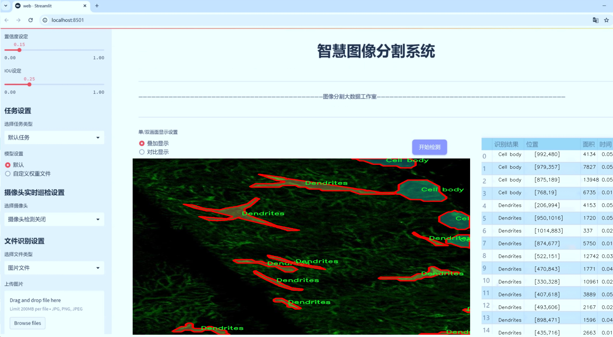
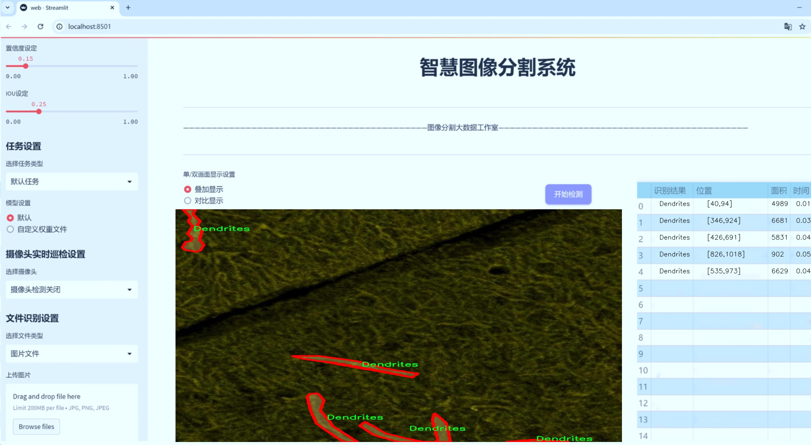
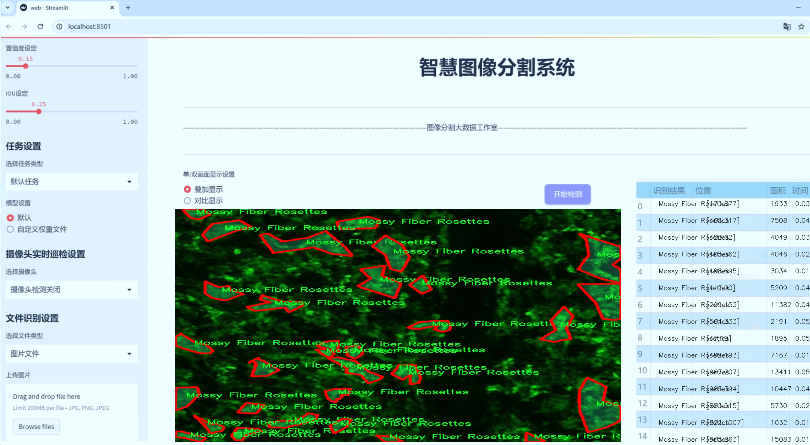
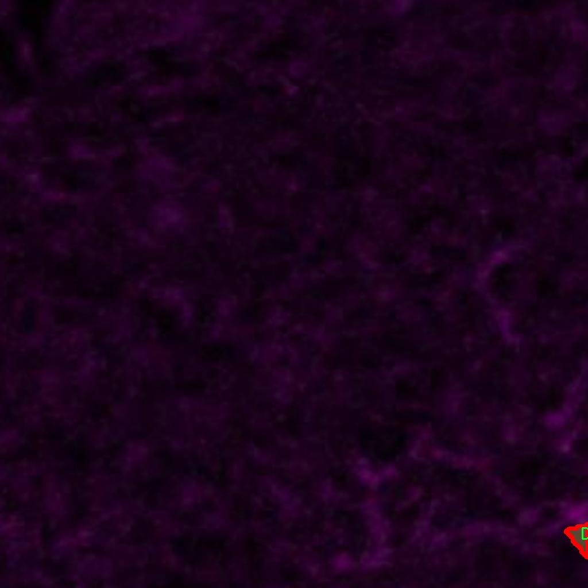
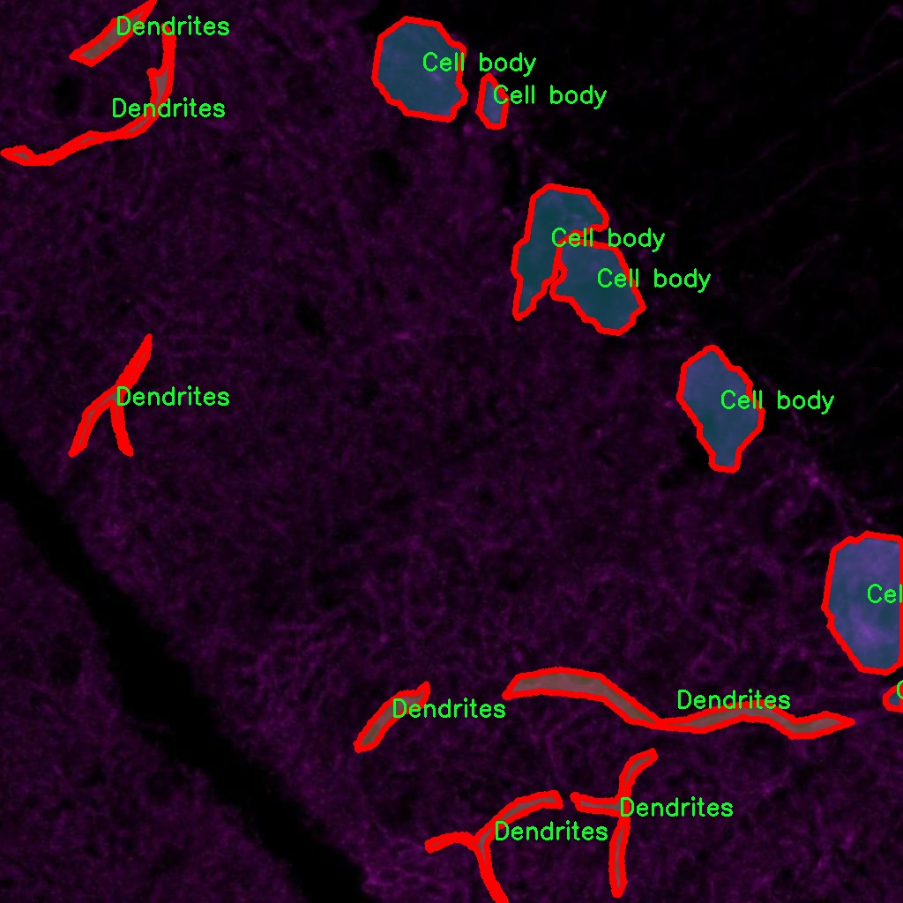
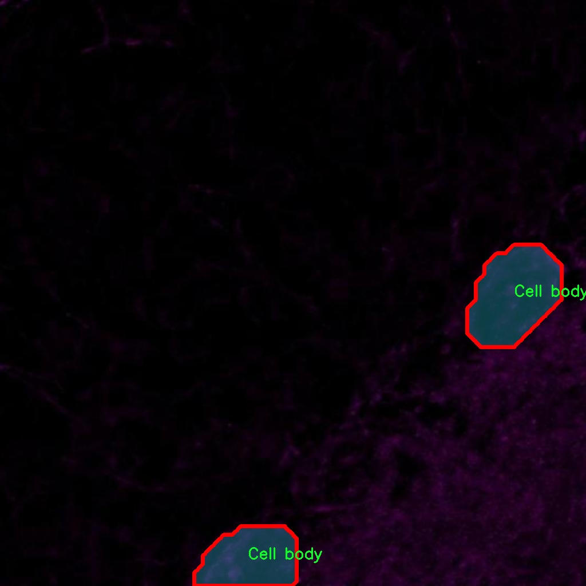
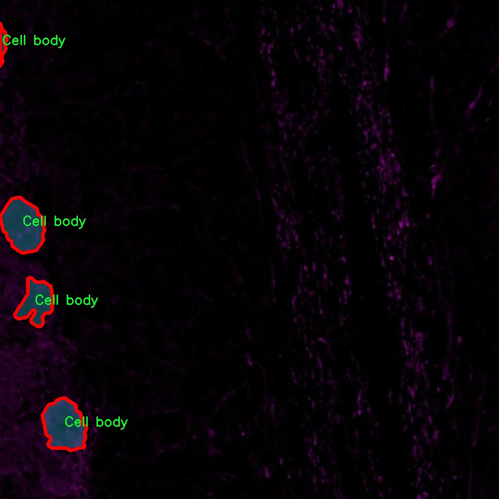
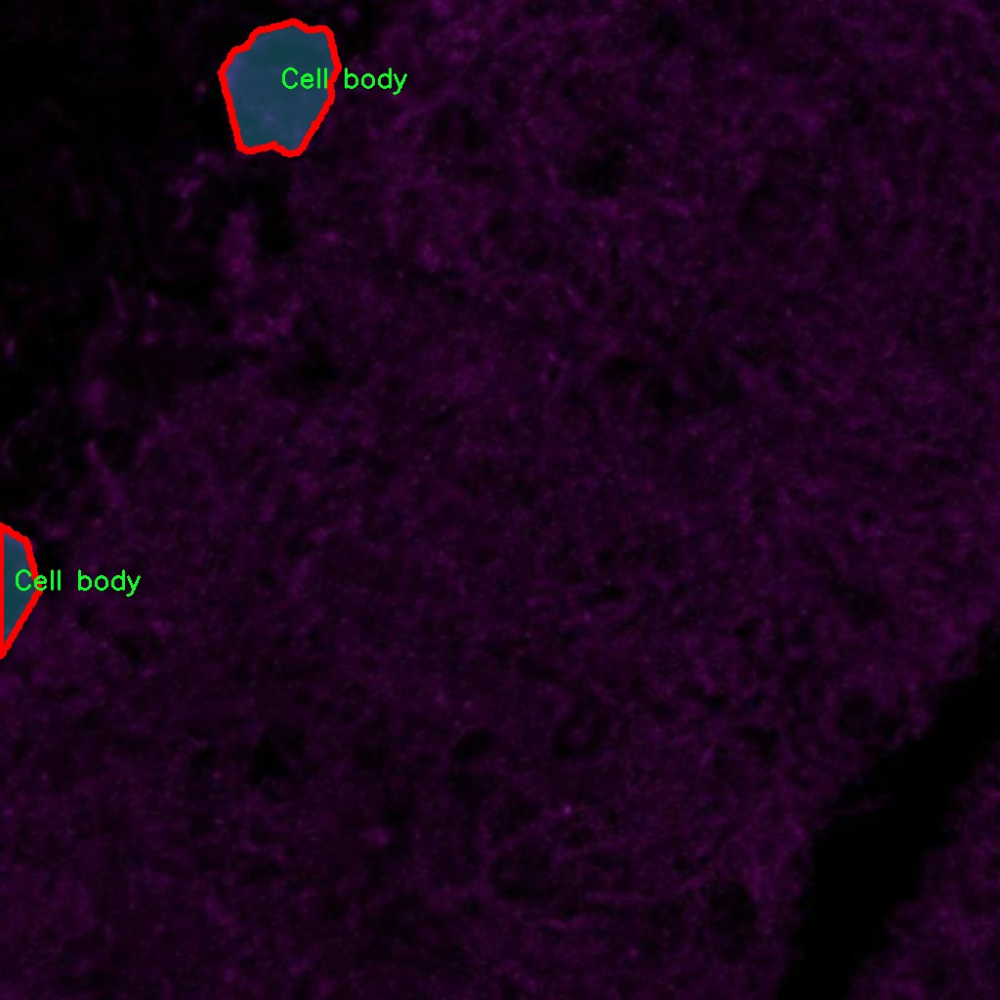

# 小鼠脑细胞结构分割系统： yolov8-seg-EfficientRepBiPAN

### 1.研究背景与意义

[参考博客](https://gitee.com/YOLOv8_YOLOv11_Segmentation_Studio/projects)

[博客来源](https://kdocs.cn/l/cszuIiCKVNis)

研究背景与意义

随着神经科学研究的不断深入，了解小鼠脑细胞的结构与功能变得愈发重要。小鼠作为一种常用的实验动物，其脑部结构与人类有着相似之处，因此在神经科学、药物开发以及疾病模型研究中，小鼠脑细胞的研究具有重要的科学价值和应用前景。近年来，随着成像技术的进步，获取高分辨率的脑细胞图像变得更加容易。然而，如何从这些图像中准确地分割出不同类型的脑细胞结构，依然是一个具有挑战性的任务。

在这一背景下，基于深度学习的图像分割技术，尤其是YOLO（You Only Look Once）系列模型，展现出了优越的性能。YOLOv8作为该系列的最新版本，具备了更高的精度和更快的处理速度，能够有效地处理复杂的图像分割任务。通过对YOLOv8模型的改进，可以更好地适应小鼠脑细胞的多样性和复杂性，进而实现高效、准确的细胞结构分割。

本研究旨在构建一个基于改进YOLOv8的小鼠脑细胞结构分割系统，利用收集到的1100幅图像和1050个最终标注的实例，进行细胞结构的自动化分割。该数据集涵盖了六个主要类别，包括细胞体、爬行纤维、树突、苔藓纤维花环、平行纤维以及VGLUT 2点，这些类别代表了小鼠脑中不同的细胞结构，具有各自独特的形态和功能特征。通过对这些细胞结构的准确分割，不仅可以为基础神经科学研究提供重要的数据支持，还能够为相关疾病的机制研究提供新的视角。

此外，准确的细胞结构分割对于后续的定量分析和功能研究至关重要。通过对分割结果的分析，研究人员可以深入探讨不同类型脑细胞在神经网络中的作用、相互关系以及在各种生理和病理状态下的变化。这对于理解脑的复杂功能、揭示神经疾病的发病机制以及开发新的治疗策略都具有重要的意义。

综上所述，基于改进YOLOv8的小鼠脑细胞结构分割系统的研究，不仅具有重要的理论价值，也具备广泛的应用前景。通过提升脑细胞分割的准确性和效率，能够为神经科学领域的研究提供更为可靠的工具，推动相关研究的深入开展。未来，随着技术的不断进步，该系统有望扩展到其他动物模型及更广泛的生物医学领域，为生物医学研究提供更为强大的支持。

### 2.图片演示







注意：本项目提供完整的训练源码数据集和训练教程,由于此博客编辑较早,暂不提供权重文件（best.pt）,需要按照6.训练教程进行训练后实现上图效果。

### 3.视频演示

[3.1 视频演示](https://www.bilibili.com/video/BV19km2Y2E6S/)

### 4.数据集信息

##### 4.1 数据集类别数＆类别名

nc: 6
names: ['Cell body', 'Climbing Fiber', 'Dendrites', 'Mossy Fiber Rosettes', 'Parallel Fiber', 'VGLUT 2 Puncta']


##### 4.2 数据集信息简介

数据集信息展示

在本研究中，我们使用了名为“Final Annotations(1050)”的数据集，旨在训练和改进YOLOv8-seg模型，以实现对小鼠脑细胞结构的精确分割。该数据集的设计和构建经过精心策划，包含了丰富的标注信息，能够有效支持我们在小鼠脑细胞图像分割任务中的研究需求。数据集共包含六个类别，分别是“Cell body”（细胞体）、“Climbing Fiber”（爬行纤维）、“Dendrites”（树突）、“Mossy Fiber Rosettes”（苔藓纤维花环）、“Parallel Fiber”（平行纤维）和“VGLUT 2 Puncta”（VGLUT 2小点）。这些类别代表了小鼠脑组织中不同的细胞结构，具有重要的生物学意义。

首先，细胞体是神经元的主要部分，负责细胞的代谢和信号传递。在小鼠脑中，细胞体的形态和分布直接影响神经元的功能和连接性，因此在分割任务中，准确识别细胞体至关重要。其次，爬行纤维是小脑中一种重要的神经纤维，其在运动协调和学习中扮演着关键角色。对爬行纤维的精确分割将有助于我们理解其在小鼠脑中的功能及其与其他神经元的相互作用。

树突是神经元接收信号的主要结构，其形态的复杂性和多样性使得树突的分割成为一项挑战。通过对树突的准确分割，我们可以更好地研究神经元之间的突触连接和信息传递过程。此外，苔藓纤维花环是小脑中独特的结构，参与信息处理和传递，了解其分布和形态对于研究小脑功能至关重要。平行纤维则是小脑皮层中的一种重要纤维，负责将信息从小脑的不同区域传递到其他神经元。最后，VGLUT 2小点是突触传递的标志，研究其分布有助于揭示神经元之间的连接强度和信息传递效率。

“Final Annotations(1050)”数据集不仅在类别上涵盖了小鼠脑细胞的多样性，还在数量上提供了足够的样本，以确保模型训练的有效性和鲁棒性。每个类别的标注都经过严格的审查和验证，确保其准确性和一致性。这些标注信息为YOLOv8-seg模型的训练提供了坚实的基础，使其能够在分割任务中实现高精度的表现。

在数据集的构建过程中，采用了先进的图像处理技术和标注工具，以确保每个细胞结构的边界清晰可辨。这种高质量的标注不仅提高了模型的训练效率，还增强了模型在实际应用中的适应性。通过对该数据集的深入分析和应用，我们期望能够推动小鼠脑细胞结构分割技术的发展，为神经科学研究提供更为精确的工具和方法。

总之，“Final Annotations(1050)”数据集在小鼠脑细胞结构分割任务中发挥着不可或缺的作用，其丰富的类别信息和高质量的标注为YOLOv8-seg模型的训练提供了坚实的基础。随着研究的深入，我们相信该数据集将为理解小鼠脑的复杂结构和功能提供重要的支持，推动神经科学领域的进一步发展。











### 5.项目依赖环境部署教程（零基础手把手教学）

[5.1 环境部署教程链接（零基础手把手教学）](https://www.bilibili.com/video/BV1jG4Ve4E9t/?vd_source=bc9aec86d164b67a7004b996143742dc)


[5.2 安装Python虚拟环境创建和依赖库安装视频教程链接（零基础手把手教学）](https://www.bilibili.com/video/BV1nA4VeYEze/?vd_source=bc9aec86d164b67a7004b996143742dc)

### 6.手把手YOLOV8-seg训练视频教程（零基础手把手教学）

[6.1 手把手YOLOV8-seg训练视频教程（零基础小白有手就能学会）](https://www.bilibili.com/video/BV1cA4VeYETe/?vd_source=bc9aec86d164b67a7004b996143742dc)


按照上面的训练视频教程链接加载项目提供的数据集，运行train.py即可开始训练



     Epoch   gpu_mem       box       obj       cls    labels  img_size
     1/200     0G   0.01576   0.01955  0.007536        22      1280: 100%|██████████| 849/849 [14:42<00:00,  1.04s/it]
               Class     Images     Labels          P          R     mAP@.5 mAP@.5:.95: 100%|██████████| 213/213 [01:14<00:00,  2.87it/s]
                 all       3395      17314      0.994      0.957      0.0957      0.0843

     Epoch   gpu_mem       box       obj       cls    labels  img_size
     2/200     0G   0.01578   0.01923  0.007006        22      1280: 100%|██████████| 849/849 [14:44<00:00,  1.04s/it]
               Class     Images     Labels          P          R     mAP@.5 mAP@.5:.95: 100%|██████████| 213/213 [01:12<00:00,  2.95it/s]
                 all       3395      17314      0.996      0.956      0.0957      0.0845

     Epoch   gpu_mem       box       obj       cls    labels  img_size
     3/200     0G   0.01561    0.0191  0.006895        27      1280: 100%|██████████| 849/849 [10:56<00:00,  1.29it/s]
               Class     Images     Labels          P          R     mAP@.5 mAP@.5:.95: 100%|███████   | 187/213 [00:52<00:00,  4.04it/s]
                 all       3395      17314      0.996      0.957      0.0957      0.0845


### 7.50+种全套YOLOV8-seg创新点加载调参实验视频教程（一键加载写好的改进模型的配置文件）

[7.1 50+种全套YOLOV8-seg创新点加载调参实验视频教程（一键加载写好的改进模型的配置文件）](https://www.bilibili.com/video/BV1Hw4VePEXv/?vd_source=bc9aec86d164b67a7004b996143742dc)

### YOLOV8-seg算法简介

原始YOLOv8-seg算法原理

YOLOv8-seg算法是YOLO系列目标检测算法的最新进展，建立在YOLOv5和YOLOv7的基础上，采用了一系列创新的设计理念和技术改进，使其在目标检测和分割任务中表现出色。该算法的结构主要由输入层、主干网络、特征融合层和解耦头组成，整体架构旨在提高检测精度和效率，同时保持轻量化特性，以适应各种应用场景。

在主干网络部分，YOLOv8-seg继续沿用YOLOv5的CSPDarknet思想，但进行了重要的改进。具体而言，YOLOv8将YOLOv5中的C3模块替换为C2f模块，这一变化不仅实现了模型的轻量化，还在保持检测精度的同时，增强了特征提取的能力。C2f模块的设计灵感来源于YOLOv7的ELAN结构，具有两个分支的特性。第一个分支直接将特征传递到Concat层，而第二个分支则通过多个Bottleneck网络进行串并联输出。这种结构有效地增加了梯度流的信息量，缓解了深层网络中的梯度消失问题，确保了网络在加深时的收敛性和精度。

在特征融合层，YOLOv8-seg采用了PAN-FPN结构，以实现多尺度特征的深度融合。该结构的设计允许高层特征与中层和浅层特征进行有效的结合，确保了模型在不同尺度下的目标检测能力。YOLOv8通过去除YOLOv5中上采样阶段的1x1卷积，简化了特征融合过程，使得高层特征在上采样后能够直接与中层特征进行Concat操作，进而与浅层特征进行融合。这种自下而上的融合策略，使得模型能够充分利用不同层次的特征信息，从而提高了目标检测的准确性。

YOLOv8-seg的另一个显著特点是其采用了Anchor-Free的设计理念，摒弃了传统的Anchor-Base方法。这一创新使得模型在处理目标时更加灵活，减少了对预定义锚框的依赖，从而提升了对小目标和复杂场景的检测能力。此外，YOLOv8-seg引入了新的损失函数设计，包括VFLLoss和DFLLoss+CIoULoss，进一步增强了模型在分类和边界框回归任务中的表现。这些损失函数的选择旨在解决样本不平衡和困难样本的问题，确保模型在训练过程中能够更好地学习到目标的特征。

在样本匹配策略方面，YOLOv8-seg采用了Task-Aligned的Assigner匹配方式，取代了以往的静态匹配策略。这一改进使得模型在训练过程中能够更好地适应不同任务的需求，提高了样本匹配的准确性和效率。数据预处理方面，YOLOv8-seg借鉴了YOLOv5的策略，采用了马赛克增强、混合增强、空间扰动和颜色扰动等多种数据增强手段，以提升模型的泛化能力。

在解耦头部分，YOLOv8-seg的设计灵感来源于YOLOX和YOLOv6，取消了objectness分支，采用了更加简化的边框回归和目标分类策略。该部分的输出特征图尺寸为80x80、40x40和20x20，确保了模型在不同尺度下的检测能力。通过将分类和回归分支解耦，YOLOv8-seg能够更加高效地进行目标检测，减少了计算复杂度，同时提升了检测精度。

综上所述，YOLOv8-seg算法通过一系列创新的设计和技术改进，在目标检测和分割任务中展现出强大的能力。其轻量化的特征提取网络、有效的特征融合策略以及灵活的样本匹配方式，使得YOLOv8-seg成为当前目标检测领域的一项重要进展。通过这些改进，YOLOv8-seg不仅提高了检测精度和效率，还为未来的研究和应用提供了广阔的前景。


### 9.系统功能展示（检测对象为举例，实际内容以本项目数据集为准）

图9.1.系统支持检测结果表格显示

  图9.2.系统支持置信度和IOU阈值手动调节

  图9.3.系统支持自定义加载权重文件best.pt(需要你通过步骤5中训练获得)

  图9.4.系统支持摄像头实时识别

  图9.5.系统支持图片识别

  图9.6.系统支持视频识别

  图9.7.系统支持识别结果文件自动保存

  图9.8.系统支持Excel导出检测结果数据


### 10.50+种全套YOLOV8-seg创新点原理讲解（非科班也可以轻松写刊发刊，V11版本正在科研待更新）

#### 10.1 由于篇幅限制，每个创新点的具体原理讲解就不一一展开，具体见下列网址中的创新点对应子项目的技术原理博客网址【Blog】：


[10.1 50+种全套YOLOV8-seg创新点原理讲解链接](https://gitee.com/qunmasj/good)

#### 10.2 部分改进模块原理讲解(完整的改进原理见上图和技术博客链接)【如果此小节的图加载失败可以通过CSDN或者Github搜索该博客的标题访问原始博客，原始博客图片显示正常】

### YOLOv8简介
YoloV8模型结构
YOLOv3之前的所有YOLO对象检测模型都是用C语言编写的，并使用了Darknet框架，Ultralytics发布了第一个使用PyTorch框架实现的YOLO (YOLOv3)；YOLOv3之后，Ultralytics发布了YOLOv5，在2023年1月，Ultralytics发布了YOLOv8，包含五个模型，用于检测、分割和分类。 YOLOv8 Nano是其中最快和最小的，而YOLOv8 Extra Large (YOLOv8x)是其中最准确但最慢的，具体模型见后续的图。

YOLOv8附带以下预训练模型:

目标检测在图像分辨率为640的COCO检测数据集上进行训练。
实例分割在图像分辨率为640的COCO分割数据集上训练。
图像分类模型在ImageNet数据集上预训练，图像分辨率为224。
YOLOv8 概述
具体到 YOLOv8 算法，其核心特性和改动可以归结为如下：

提供了一个全新的SOTA模型（state-of-the-art model），包括 P5 640 和 P6 1280 分辨率的目标检测网络和基于YOLACT的实例分割模型。和 YOLOv5 一样，基于缩放系数也提供了 N/S/M/L/X 尺度的不同大小模型，用于满足不同场景需求
骨干网络和 Neck 部分可能参考了 YOLOv7 ELAN 设计思想，将 YOLOv5 的 C3 结构换成了梯度流更丰富的 C2f 结构，并对不同尺度模型调整了不同的通道数，属于对模型结构精心微调，不再是一套参数应用所有模型，大幅提升了模型性能。
Head 部分相比 YOLOv5 改动较大，换成了目前主流的解耦头结构，将分类和检测头分离，同时也从Anchor-Based 换成了 Anchor-Free
Loss 计算方面采用了TaskAlignedAssigner正样本分配策略，并引入了Distribution Focal Loss
训练的数据增强部分引入了 YOLOX 中的最后 10 epoch 关闭 Mosiac 增强的操作，可以有效地提升精度


### HRNet V2简介
现在设计高低分辨率融合的思路主要有以下四种：


（a）对称结构。如U-Net、Hourglass等，都是先下采样再上采样，上下采样过程对称。

（b）级联金字塔。如refinenet等，高低分辨率融合时经过卷积处理。

（c）简单的baseline，用转职卷积进行上采样。

（d）扩张卷积。如deeplab等，增大感受野，减少下采样次数，可以无需跳层连接直接进行上采样。

（b）（c）都是使用复杂一些的网络进行下采样（如resnet、vgg），再用轻量级的网络进行上采样。

HRNet V1是在（b）的基础上进行改进，从头到尾保持大的分辨率表示。然而HRNet V1仅是用在姿态估计领域的，HRNet V2对它做小小的改进可以使其适用于更广的视觉任务。这一改进仅仅增加了较小的计算开销，但却提升了较大的准确度。

#### 网络结构图：


这个结构图简洁明了就不多介绍了，首先图2的输入是已经经过下采样四倍的feature map，横向的conv block指的是basicblock 或 bottleblock，不同分辨率之间的多交叉线部分是multi-resolution convolution（多分辨率组卷积）。

到此为止HRNet V2和HRNet V1是完全一致的。

区别之处在于这个基网络上加的一个head：


图3介绍的是接在图2最后的head。（a）是HRNet V1的头，很明显他只用了大分辨率的特征图。（b）（c）是HRNet V2的创新点，（b）用与语义分割，（c）用于目标检测。除此之外作者还在实验部分介绍了用于分类的head，如图4所示。


#### 多分辨率block：


一个多分辨率block由多分辨率组卷积（a）和多分辨率卷积（b）组成。（c）是一个正常卷积的展开，（b）的灵感来源于（c）。代码中（a）部分由Bottleneck和BasicBlock组成。

多分辨率卷积和正常卷积的区别：（1）多分辨率卷积中，每个通道的subset的分辨率都不一样。（2）通道之间的连接如果是降分辨率，则用的是3x3的2stride的卷积，如果是升分辨率，用的是双线性最邻近插值上采样。


### 11.项目核心源码讲解（再也不用担心看不懂代码逻辑）

#### 11.1 ultralytics\nn\extra_modules\__init__.py

在这段代码中，主要是从不同的模块中导入了一些功能。为了提取出最核心的部分，我们可以将这些导入语句进行整理，并为每个模块添加详细的中文注释。以下是经过整理和注释后的代码：

```python
# 从 afpn 模块导入所有内容
from .afpn import *  # AFPN（Adaptive Feature Pyramid Network）用于特征金字塔的自适应处理

# 从 attention 模块导入所有内容
from .attention import *  # Attention 机制用于增强模型对重要特征的关注

# 从 block 模块导入所有内容
from .block import *  # 定义基本的网络块，用于构建深度学习模型的基本单元

# 从 head 模块导入所有内容
from .head import *  # 网络的头部，通常用于输出层的定义和处理

# 从 rep_block 模块导入所有内容
from .rep_block import *  # 重复块，通常用于构建深层网络中的重复结构

# 从 kernel_warehouse 模块导入所有内容
from .kernel_warehouse import *  # 内核仓库，可能用于存储和管理卷积核

# 从 dynamic_snake_conv 模块导入所有内容
from .dynamic_snake_conv import *  # 动态蛇形卷积，可能是一种特殊的卷积操作

# 从 orepa 模块导入所有内容
from .orepa import *  # OREPA（Object Recognition Enhanced by Pyramid Attention）相关功能

# 从 RFAConv 模块导入所有内容
from .RFAConv import *  # RFAConv（Receptive Field Attention Convolution）用于接收域注意力卷积
```

### 核心部分分析：
1. **模块导入**：这段代码主要是将不同模块的功能导入到当前文件中，便于后续使用。
2. **功能概述**：每个模块都有其特定的功能，例如特征金字塔、注意力机制、网络结构的基本单元等。这些模块的组合可以构建出复杂的深度学习模型。

### 注释目的：
通过注释，可以帮助后续的开发者或使用者快速理解每个模块的用途和功能，便于维护和扩展代码。

这个文件是一个Python模块的初始化文件，位于`ultralytics/nn/extra_modules/`目录下。它的主要作用是导入该目录下的多个子模块，使得在使用这个模块时，可以直接访问这些子模块中的功能，而不需要单独导入每一个子模块。

具体来说，这个文件通过`from .<module_name> import *`的方式导入了以下几个子模块：

1. `afpn`：可能实现了一种特定的特征金字塔网络（FPN）结构，用于处理不同尺度的特征图。
2. `attention`：通常与注意力机制相关，可能用于增强模型对重要特征的关注。
3. `block`：可能定义了一些基本的网络层或模块，供其他模型使用。
4. `head`：通常指的是网络的输出部分，可能实现了分类或回归的功能。
5. `rep_block`：可能是指某种重复块结构，常用于构建深度神经网络。
6. `kernel_warehouse`：可能与卷积核的管理或生成有关，可能用于动态调整卷积操作。
7. `dynamic_snake_conv`：可能实现了一种动态的卷积结构，可能与图像处理或目标检测相关。
8. `orepa`：具体功能不详，可能是某种特定的模块或算法。
9. `RFAConv`：可能实现了一种特定的卷积操作，可能与特征提取或图像处理相关。

通过这个初始化文件，用户在导入`ultralytics.nn.extra_modules`模块时，可以直接使用上述所有子模块中的功能，简化了使用过程。这个文件的设计体现了模块化编程的思想，使得代码结构更加清晰，易于维护和扩展。

#### 11.2 ultralytics\trackers\utils\kalman_filter.py

以下是经过简化和注释的核心代码部分，主要包括 `KalmanFilterXYAH` 类的关键方法。该类实现了一个简单的卡尔曼滤波器，用于在图像空间中跟踪边界框。

```python
import numpy as np
import scipy.linalg

class KalmanFilterXYAH:
    """
    简单的卡尔曼滤波器，用于在图像空间中跟踪边界框。
    状态空间为8维 (x, y, a, h, vx, vy, va, vh)，
    包含边界框中心位置 (x, y)，长宽比 a，高度 h 及其各自的速度。
    """

    def __init__(self):
        """初始化卡尔曼滤波器的模型矩阵和不确定性权重。"""
        ndim, dt = 4, 1.  # 状态维度和时间步长

        # 创建卡尔曼滤波器模型矩阵
        self._motion_mat = np.eye(2 * ndim, 2 * ndim)  # 运动矩阵
        for i in range(ndim):
            self._motion_mat[i, ndim + i] = dt  # 设置速度的影响
        self._update_mat = np.eye(ndim, 2 * ndim)  # 更新矩阵

        # 运动和观测不确定性权重
        self._std_weight_position = 1. / 20
        self._std_weight_velocity = 1. / 160

    def initiate(self, measurement):
        """
        从未关联的测量创建跟踪。

        参数
        ----------
        measurement : ndarray
            边界框坐标 (x, y, a, h)。

        返回
        -------
        (ndarray, ndarray)
            返回新的跟踪的均值向量和协方差矩阵。
        """
        mean_pos = measurement  # 均值位置
        mean_vel = np.zeros_like(mean_pos)  # 初始化速度为0
        mean = np.r_[mean_pos, mean_vel]  # 合并位置和速度

        # 计算协方差矩阵的标准差
        std = [
            2 * self._std_weight_position * measurement[3],  # y方向位置的不确定性
            2 * self._std_weight_position * measurement[3],  # x方向位置的不确定性
            1e-2,  # 长宽比的不确定性
            2 * self._std_weight_position * measurement[3],  # 高度的不确定性
            10 * self._std_weight_velocity * measurement[3],  # y方向速度的不确定性
            10 * self._std_weight_velocity * measurement[3],  # x方向速度的不确定性
            1e-5,  # 长宽比速度的不确定性
            10 * self._std_weight_velocity * measurement[3]   # 高度速度的不确定性
        ]
        covariance = np.diag(np.square(std))  # 生成协方差矩阵
        return mean, covariance

    def predict(self, mean, covariance):
        """
        执行卡尔曼滤波器的预测步骤。

        参数
        ----------
        mean : ndarray
            上一时间步的状态均值向量。
        covariance : ndarray
            上一时间步的状态协方差矩阵。

        返回
        -------
        (ndarray, ndarray)
            返回预测状态的均值向量和协方差矩阵。
        """
        # 计算运动协方差
        std_pos = [
            self._std_weight_position * mean[3],  # y方向位置的不确定性
            self._std_weight_position * mean[3],  # x方向位置的不确定性
            1e-2,  # 长宽比的不确定性
            self._std_weight_position * mean[3]   # 高度的不确定性
        ]
        std_vel = [
            self._std_weight_velocity * mean[3],  # y方向速度的不确定性
            self._std_weight_velocity * mean[3],  # x方向速度的不确定性
            1e-5,  # 长宽比速度的不确定性
            self._std_weight_velocity * mean[3]   # 高度速度的不确定性
        ]
        motion_cov = np.diag(np.square(np.r_[std_pos, std_vel]))  # 运动协方差矩阵

        # 预测均值和协方差
        mean = np.dot(mean, self._motion_mat.T)  # 更新均值
        covariance = np.linalg.multi_dot((self._motion_mat, covariance, self._motion_mat.T)) + motion_cov  # 更新协方差

        return mean, covariance

    def update(self, mean, covariance, measurement):
        """
        执行卡尔曼滤波器的校正步骤。

        参数
        ----------
        mean : ndarray
            预测状态的均值向量。
        covariance : ndarray
            状态的协方差矩阵。
        measurement : ndarray
            测量向量 (x, y, a, h)。

        返回
        -------
        (ndarray, ndarray)
            返回经过测量校正后的状态分布。
        """
        # 投影到测量空间
        projected_mean, projected_cov = self.project(mean, covariance)

        # 计算卡尔曼增益
        chol_factor, lower = scipy.linalg.cho_factor(projected_cov, lower=True, check_finite=False)
        kalman_gain = scipy.linalg.cho_solve((chol_factor, lower),
                                             np.dot(covariance, self._update_mat.T).T,
                                             check_finite=False).T
        innovation = measurement - projected_mean  # 计算创新

        # 更新均值和协方差
        new_mean = mean + np.dot(innovation, kalman_gain.T)
        new_covariance = covariance - np.linalg.multi_dot((kalman_gain, projected_cov, kalman_gain.T))
        return new_mean, new_covariance
```

### 代码说明
1. **类初始化**：`__init__` 方法中定义了卡尔曼滤波器的运动矩阵和更新矩阵，并设置了位置和速度的不确定性权重。
2. **初始化跟踪**：`initiate` 方法根据输入的边界框测量值创建初始状态的均值和协方差矩阵。
3. **预测步骤**：`predict` 方法根据当前状态的均值和协方差预测下一个状态。
4. **更新步骤**：`update` 方法通过测量值校正预测的状态，计算卡尔曼增益并更新均值和协方差。

这个程序文件实现了一个简单的卡尔曼滤波器，用于在图像空间中跟踪边界框。它包含两个类：`KalmanFilterXYAH`和`KalmanFilterXYWH`，分别用于处理不同的边界框表示方式。

`KalmanFilterXYAH`类使用的是包含中心位置（x, y）、长宽比（a）、高度（h）及其各自速度的8维状态空间。这个类的主要功能包括初始化卡尔曼滤波器的模型矩阵、预测对象的状态、更新状态以及计算测量的距离等。它的构造函数初始化了运动矩阵和更新矩阵，并设置了运动和观测的不确定性权重。`initiate`方法用于从未关联的测量值创建新的跟踪对象，返回状态的均值向量和协方差矩阵。`predict`方法用于执行预测步骤，更新状态的均值和协方差。`project`方法将状态分布投影到测量空间，计算新的均值和协方差。`update`方法执行卡尔曼滤波的校正步骤，结合预测的状态和新的测量值来更新状态。`gating_distance`方法计算状态分布与测量值之间的距离，支持使用不同的距离度量方法。

`KalmanFilterXYWH`类是`KalmanFilterXYAH`的子类，专门用于处理包含中心位置（x, y）、宽度（w）、高度（h）及其各自速度的边界框表示。它重写了`initiate`、`predict`、`project`和`update`方法，以适应新的状态表示方式。该类的设计与父类相似，但在初始化标准差和协方差矩阵时考虑了宽度和高度的影响。

整体而言，这个文件实现了一个灵活的卡尔曼滤波器，可以根据不同的边界框表示方式进行对象跟踪，适用于各种计算机视觉任务。

#### 11.3 ultralytics\utils\callbacks\dvc.py

以下是经过简化和注释的核心代码部分，主要功能是使用DVCLive记录训练过程中的各种信息。

```python
# 导入必要的库
from ultralytics.utils import LOGGER, SETTINGS, TESTS_RUNNING, checks

try:
    # 确保当前不是在测试环境中
    assert not TESTS_RUNNING  
    # 确保DVC集成已启用
    assert SETTINGS['dvc'] is True  
    import dvclive  # 导入DVCLive库
    # 检查DVCLive版本
    assert checks.check_version('dvclive', '2.11.0', verbose=True)

    import os
    import re
    from pathlib import Path

    # 初始化DVCLive记录器实例
    live = None
    _processed_plots = {}  # 存储已处理的图表

    # 用于标识训练周期的全局变量
    _training_epoch = False

except (ImportError, AssertionError, TypeError):
    dvclive = None  # 如果导入失败，则将dvclive设置为None


def _log_images(path, prefix=''):
    """记录指定路径的图像，使用可选前缀。"""
    if live:  # 如果DVCLive已初始化
        name = path.name
        # 通过批次分组图像，以便在UI中启用滑块
        m = re.search(r'_batch(\d+)', name)
        if m:
            ni = m[1]
            new_stem = re.sub(r'_batch(\d+)', '_batch', path.stem)
            name = (Path(new_stem) / ni).with_suffix(path.suffix)

        live.log_image(os.path.join(prefix, name), path)  # 记录图像


def _log_plots(plots, prefix=''):
    """记录训练进度的图像，如果它们尚未被处理。"""
    for name, params in plots.items():
        timestamp = params['timestamp']
        if _processed_plots.get(name) != timestamp:  # 检查图表是否已处理
            _log_images(name, prefix)  # 记录图像
            _processed_plots[name] = timestamp  # 更新已处理图表的时间戳


def on_pretrain_routine_start(trainer):
    """在预训练例程开始时初始化DVCLive记录器。"""
    try:
        global live
        live = dvclive.Live(save_dvc_exp=True, cache_images=True)  # 初始化DVCLive
        LOGGER.info("DVCLive已检测到，自动记录已启用。")
    except Exception as e:
        LOGGER.warning(f'警告 ⚠️ DVCLive安装但未正确初始化，未记录此运行。 {e}')


def on_train_start(trainer):
    """如果DVCLive记录处于活动状态，则记录训练参数。"""
    if live:
        live.log_params(trainer.args)  # 记录训练参数


def on_fit_epoch_end(trainer):
    """在每个训练周期结束时记录训练指标和模型信息。"""
    global _training_epoch
    if live and _training_epoch:  # 如果DVCLive已初始化且当前为训练周期
        all_metrics = {**trainer.label_loss_items(trainer.tloss, prefix='train'), **trainer.metrics, **trainer.lr}
        for metric, value in all_metrics.items():
            live.log_metric(metric, value)  # 记录每个指标

        _log_plots(trainer.plots, 'train')  # 记录训练图表
        live.next_step()  # 进入下一步
        _training_epoch = False  # 重置训练周期标识


def on_train_end(trainer):
    """在训练结束时记录最佳指标、图表和混淆矩阵。"""
    if live:
        all_metrics = {**trainer.label_loss_items(trainer.tloss, prefix='train'), **trainer.metrics, **trainer.lr}
        for metric, value in all_metrics.items():
            live.log_metric(metric, value, plot=False)  # 记录最佳指标

        _log_plots(trainer.plots, 'val')  # 记录验证图表
        # 记录混淆矩阵
        if trainer.best.exists():
            live.log_artifact(trainer.best, copy=True, type='model')  # 记录最佳模型

        live.end()  # 结束记录


# 定义回调函数
callbacks = {
    'on_pretrain_routine_start': on_pretrain_routine_start,
    'on_train_start': on_train_start,
    'on_fit_epoch_end': on_fit_epoch_end,
    'on_train_end': on_train_end
} if dvclive else {}
```

### 代码说明：
1. **导入库**：导入了必要的库和模块，主要用于日志记录和路径处理。
2. **异常处理**：在尝试导入DVCLive和进行版本检查时，使用异常处理来确保程序的稳定性。
3. **日志记录功能**：定义了一系列函数来记录图像、图表、训练参数和混淆矩阵等信息，便于后续分析和可视化。
4. **回调函数**：定义了一组回调函数，在训练的不同阶段被调用，以记录相关信息。

这个程序文件 `ultralytics/utils/callbacks/dvc.py` 是一个用于集成 DVCLive 的回调模块，主要用于在训练过程中记录和可视化模型的训练进度和性能指标。代码首先导入了一些必要的模块和库，并进行了一些基本的检查，以确保 DVCLive 的集成是启用的。

在文件中，首先定义了一个 `live` 变量，用于存储 DVCLive 的实例，以及一个 `_processed_plots` 字典，用于跟踪已经处理过的绘图。接下来，定义了一些私有函数，例如 `_log_images`、`_log_plots` 和 `_log_confusion_matrix`，这些函数分别用于记录图像、绘图和混淆矩阵。

`_log_images` 函数会将指定路径下的图像记录到 DVCLive 中，并且支持根据批次分组图像，以便在用户界面中实现滑块功能。`_log_plots` 函数会记录训练过程中的绘图，如果这些绘图尚未被处理过。`_log_confusion_matrix` 函数则用于记录给定验证器的混淆矩阵。

接下来的几个函数是训练过程中的回调函数，包括 `on_pretrain_routine_start`、`on_pretrain_routine_end`、`on_train_start`、`on_train_epoch_start`、`on_fit_epoch_end` 和 `on_train_end`。这些函数在训练的不同阶段被调用，分别用于初始化 DVCLive 记录器、记录训练参数、记录每个训练周期的指标和模型信息、以及在训练结束时记录最佳指标和混淆矩阵。

最后，代码将这些回调函数组织成一个字典 `callbacks`，以便在 DVCLive 可用时进行调用。如果 DVCLive 未正确初始化，相关的回调将不会被添加到字典中。

整体而言，这个模块通过与 DVCLive 的集成，提供了一种便捷的方式来监控和记录模型训练过程中的各种指标和图像，帮助用户更好地理解和优化模型的性能。

#### 11.4 ultralytics\models\sam\modules\tiny_encoder.py

以下是经过简化并添加详细中文注释的核心代码部分：

```python
import torch
import torch.nn as nn
import torch.nn.functional as F

class Conv2d_BN(torch.nn.Sequential):
    """执行2D卷积并随后进行批量归一化的序列容器。"""

    def __init__(self, in_channels, out_channels, kernel_size=1, stride=1, padding=0):
        """初始化卷积层和批量归一化层。"""
        super().__init__()
        # 添加卷积层
        self.add_module('conv', nn.Conv2d(in_channels, out_channels, kernel_size, stride, padding, bias=False))
        # 添加批量归一化层
        self.add_module('bn', nn.BatchNorm2d(out_channels))

class PatchEmbed(nn.Module):
    """将图像嵌入为补丁并投影到指定的嵌入维度。"""

    def __init__(self, in_chans, embed_dim, resolution, activation):
        """初始化补丁嵌入层。"""
        super().__init__()
        img_size = (resolution, resolution)  # 假设输入为正方形图像
        self.patches_resolution = (img_size[0] // 4, img_size[1] // 4)  # 每个补丁的分辨率
        self.seq = nn.Sequential(
            Conv2d_BN(in_chans, embed_dim // 2, kernel_size=3, stride=2, padding=1),
            activation(),
            Conv2d_BN(embed_dim // 2, embed_dim, kernel_size=3, stride=2, padding=1),
        )

    def forward(self, x):
        """将输入张量通过补丁嵌入层的序列操作。"""
        return self.seq(x)

class TinyViT(nn.Module):
    """TinyViT架构，用于视觉任务。"""

    def __init__(self, img_size=224, in_chans=3, num_classes=1000, embed_dims=[96, 192, 384, 768], depths=[2, 2, 6, 2]):
        """初始化TinyViT模型。"""
        super().__init__()
        self.img_size = img_size
        self.num_classes = num_classes

        # 初始化补丁嵌入层
        self.patch_embed = PatchEmbed(in_chans=in_chans, embed_dim=embed_dims[0], resolution=img_size, activation=nn.GELU)

        # 构建层
        self.layers = nn.ModuleList()
        for i_layer in range(len(depths)):
            layer = BasicLayer(dim=embed_dims[i_layer], depth=depths[i_layer])  # 假设BasicLayer是定义好的
            self.layers.append(layer)

        # 分类头
        self.head = nn.Linear(embed_dims[-1], num_classes) if num_classes > 0 else nn.Identity()

    def forward(self, x):
        """执行前向传播，返回模型的输出。"""
        x = self.patch_embed(x)  # 将输入嵌入为补丁
        for layer in self.layers:
            x = layer(x)  # 通过每一层
        return self.head(x)  # 通过分类头

# 这里省略了其他辅助类（如BasicLayer、Mlp、Attention等），可以根据需要添加。
```

### 代码说明：
1. **Conv2d_BN**：定义了一个包含卷积层和批量归一化层的序列容器，便于构建卷积神经网络的基本模块。
2. **PatchEmbed**：将输入图像分割成多个补丁，并通过卷积层将其嵌入到指定的维度中，适用于视觉任务。
3. **TinyViT**：这是整个模型的核心类，负责初始化补丁嵌入层和多个基本层（如`BasicLayer`），并在前向传播中处理输入数据，最终输出分类结果。

这段代码展示了TinyViT模型的基本结构和功能，省略了其他细节以保持简洁。

这个程序文件 `tiny_encoder.py` 实现了一个名为 TinyViT 的视觉模型架构，主要用于图像处理任务。TinyViT 是一种轻量级的视觉变换器（Vision Transformer），其设计灵感来源于 EfficientNet 和其他变换器架构，如 LeViT 和 Swin Transformer。文件中包含多个类，每个类负责模型的不同组成部分。

首先，`Conv2d_BN` 类定义了一个包含二维卷积和批量归一化的顺序容器。这个类在初始化时接受多个参数，包括输入和输出通道数、卷积核大小、步幅等。它的主要功能是构建一个带有批量归一化的卷积层。

接下来，`PatchEmbed` 类负责将输入图像嵌入为多个小块（patches），并将这些小块投影到指定的嵌入维度。该类的构造函数接收输入通道数、嵌入维度、图像分辨率和激活函数，并通过一系列卷积层将输入图像转换为嵌入表示。

`MBConv` 类实现了移动反向瓶颈卷积层（Mobile Inverted Bottleneck Conv），这是 EfficientNet 架构中的关键组件。它通过多个卷积层和激活函数来处理输入，并使用残差连接来增强模型的学习能力。

`PatchMerging` 类则负责将相邻的小块合并，并将其投影到新的维度。它通过一系列卷积操作来实现这一点，并在前向传播中处理输入张量。

`ConvLayer` 类构建了一个包含多个 MBConv 层的卷积层，可以选择性地对输出进行下采样。它还支持梯度检查点，以节省内存。

`Mlp` 类实现了多层感知机（MLP），用于变换器架构中的前馈网络。它包括层归一化和两个全连接层，能够对输入进行非线性变换。

`Attention` 类实现了多头注意力机制，支持空间感知。它使用可训练的注意力偏置来增强模型的表达能力，并在前向传播中计算查询、键和值的注意力。

`TinyViTBlock` 类是 TinyViT 的基本构建块，结合了自注意力和局部卷积。它通过前向传播对输入进行变换，并使用局部卷积来进一步处理特征。

`BasicLayer` 类构建了一个基本的 TinyViT 层，包含多个 TinyViT 块，并可选择性地进行下采样。

`LayerNorm2d` 类实现了二维层归一化，主要用于规范化输入张量。

最后，`TinyViT` 类是整个模型的主类，负责初始化模型的各个部分，包括图像大小、输入通道数、类别数、嵌入维度、深度、注意力头数等。它还定义了前向传播方法，处理输入图像并返回经过处理的特征。

总体而言，这个文件实现了一个复杂的视觉模型，结合了卷积层、注意力机制和多层感知机，旨在高效地处理图像数据并进行分类任务。

#### 11.5 ultralytics\models\yolo\pose\predict.py

以下是经过简化和详细注释的核心代码部分：

```python
# 导入必要的模块和类
from ultralytics.engine.results import Results
from ultralytics.models.yolo.detect.predict import DetectionPredictor
from ultralytics.utils import ops

class PosePredictor(DetectionPredictor):
    """
    PosePredictor类，继承自DetectionPredictor，用于基于姿态模型进行预测。
    """

    def __init__(self, cfg=DEFAULT_CFG, overrides=None, _callbacks=None):
        """初始化PosePredictor，设置任务为'pose'并记录使用'mps'作为设备的警告信息。"""
        super().__init__(cfg, overrides, _callbacks)  # 调用父类构造函数
        self.args.task = 'pose'  # 设置任务类型为姿态检测
        # 检查设备类型，如果是Apple MPS，记录警告信息
        if isinstance(self.args.device, str) and self.args.device.lower() == 'mps':
            LOGGER.warning("WARNING ⚠️ Apple MPS known Pose bug. Recommend 'device=cpu' for Pose models.")

    def postprocess(self, preds, img, orig_imgs):
        """对给定输入图像或图像列表返回检测结果。"""
        # 应用非极大值抑制，过滤掉低置信度的检测框
        preds = ops.non_max_suppression(preds,
                                        self.args.conf,  # 置信度阈值
                                        self.args.iou,   # IOU阈值
                                        agnostic=self.args.agnostic_nms,  # 是否类别无关的NMS
                                        max_det=self.args.max_det,  # 最大检测框数量
                                        classes=self.args.classes,  # 过滤的类别
                                        nc=len(self.model.names))  # 类别数量

        # 如果输入图像不是列表，则将其转换为numpy数组
        if not isinstance(orig_imgs, list):
            orig_imgs = ops.convert_torch2numpy_batch(orig_imgs)

        results = []  # 存储结果的列表
        for i, pred in enumerate(preds):  # 遍历每个预测结果
            orig_img = orig_imgs[i]  # 获取原始图像
            # 调整检测框坐标到原始图像的尺度
            pred[:, :4] = ops.scale_boxes(img.shape[2:], pred[:, :4], orig_img.shape).round()
            # 获取关键点预测并调整坐标
            pred_kpts = pred[:, 6:].view(len(pred), *self.model.kpt_shape) if len(pred) else pred[:, 6:]
            pred_kpts = ops.scale_coords(img.shape[2:], pred_kpts, orig_img.shape)
            img_path = self.batch[0][i]  # 获取图像路径
            # 将结果存储到Results对象中
            results.append(
                Results(orig_img, path=img_path, names=self.model.names, boxes=pred[:, :6], keypoints=pred_kpts))
        return results  # 返回检测结果
```

### 代码说明：
1. **PosePredictor类**：该类继承自`DetectionPredictor`，用于处理姿态检测的预测。
2. **构造函数`__init__`**：初始化时设置任务类型为姿态检测，并检查设备类型，如果是Apple的MPS设备，则发出警告。
3. **`postprocess`方法**：处理模型的输出，进行非极大值抑制，调整检测框和关键点的坐标，并将结果封装到`Results`对象中返回。

这个程序文件是Ultralytics YOLO框架中的一个用于姿态预测的类，名为`PosePredictor`，它继承自`DetectionPredictor`类。该类的主要功能是基于姿态模型进行预测。

在文件开头，导入了一些必要的模块和类，包括`Results`、`DetectionPredictor`和一些工具函数。`PosePredictor`类的定义包含了一个文档字符串，提供了使用示例，展示了如何实例化该类并调用其预测功能。

在`__init__`方法中，首先调用父类的构造函数进行初始化，并将任务类型设置为“pose”。如果用户指定的设备是“mps”（即Apple的Metal Performance Shaders），则会发出警告，提示该设备在姿态模型上可能存在已知问题，建议使用CPU作为设备。

`postprocess`方法负责处理模型的预测结果。它接收预测结果、输入图像及原始图像作为参数。首先，使用非极大值抑制（NMS）对预测结果进行过滤，以减少冗余的检测框。接着，如果输入的原始图像不是列表格式，则将其转换为NumPy数组格式。

然后，方法会遍历每个预测结果，并对每个结果进行坐标缩放，以适应原始图像的尺寸。预测的关键点也会进行相应的坐标缩放。最后，将处理后的结果封装成`Results`对象，并返回一个包含所有结果的列表。

总体而言，这个文件实现了一个姿态预测的功能，能够处理输入图像并返回检测到的关键点和框的结果，适用于姿态估计任务。

### 12.系统整体结构（节选）

### 程序整体功能和构架概括

该程序是Ultralytics YOLO框架的一部分，主要用于计算机视觉任务，包括目标检测、姿态估计和图像处理。整个框架采用模块化设计，便于扩展和维护。各个模块通过类和函数实现不同的功能，涵盖了从模型构建、训练到预测的完整流程。

1. **模型构建**：通过定义各种神经网络层和模块（如卷积层、注意力机制等），实现了高效的视觉模型（如TinyViT）。
2. **目标跟踪**：实现了卡尔曼滤波器，用于在视频流中跟踪目标。
3. **训练回调**：集成了DVCLive，用于记录和可视化训练过程中的指标和图像。
4. **姿态预测**：提供了姿态估计的功能，能够处理输入图像并返回关键点和框的结果。

### 文件功能整理表

| 文件路径                                         | 功能描述                                                                                          |
|--------------------------------------------------|---------------------------------------------------------------------------------------------------|
| `ultralytics/nn/extra_modules/__init__.py`      | 初始化模块，导入多个子模块，简化用户访问功能。                                                    |
| `ultralytics/trackers/utils/kalman_filter.py`   | 实现卡尔曼滤波器，提供对象跟踪功能，支持不同的边界框表示（XYAH和XYWH）。                          |
| `ultralytics/utils/callbacks/dvc.py`            | 集成DVCLive，用于记录和可视化训练过程中的指标和图像，提供训练过程中的回调函数。                  |
| `ultralytics/models/sam/modules/tiny_encoder.py`| 实现TinyViT视觉模型，包含多个神经网络层和模块，适用于图像处理任务。                             |
| `ultralytics/models/yolo/pose/predict.py`       | 实现姿态预测功能，处理输入图像并返回检测到的关键点和框的结果，适用于姿态估计任务。              |

这个表格总结了每个文件的主要功能，展示了Ultralytics YOLO框架的模块化设计和各个部分的相互作用。

### 13.图片、视频、摄像头图像分割Demo(去除WebUI)代码

在这个博客小节中，我们将讨论如何在不使用WebUI的情况下，实现图像分割模型的使用。本项目代码已经优化整合，方便用户将分割功能嵌入自己的项目中。
核心功能包括图片、视频、摄像头图像的分割，ROI区域的轮廓提取、类别分类、周长计算、面积计算、圆度计算以及颜色提取等。
这些功能提供了良好的二次开发基础。

### 核心代码解读

以下是主要代码片段，我们会为每一块代码进行详细的批注解释：

```python
import random
import cv2
import numpy as np
from PIL import ImageFont, ImageDraw, Image
from hashlib import md5
from model import Web_Detector
from chinese_name_list import Label_list

# 根据名称生成颜色
def generate_color_based_on_name(name):
    ......

# 计算多边形面积
def calculate_polygon_area(points):
    return cv2.contourArea(points.astype(np.float32))

...
# 绘制中文标签
def draw_with_chinese(image, text, position, font_size=20, color=(255, 0, 0)):
    image_pil = Image.fromarray(cv2.cvtColor(image, cv2.COLOR_BGR2RGB))
    draw = ImageDraw.Draw(image_pil)
    font = ImageFont.truetype("simsun.ttc", font_size, encoding="unic")
    draw.text(position, text, font=font, fill=color)
    return cv2.cvtColor(np.array(image_pil), cv2.COLOR_RGB2BGR)

# 动态调整参数
def adjust_parameter(image_size, base_size=1000):
    max_size = max(image_size)
    return max_size / base_size

# 绘制检测结果
def draw_detections(image, info, alpha=0.2):
    name, bbox, conf, cls_id, mask = info['class_name'], info['bbox'], info['score'], info['class_id'], info['mask']
    adjust_param = adjust_parameter(image.shape[:2])
    spacing = int(20 * adjust_param)

    if mask is None:
        x1, y1, x2, y2 = bbox
        aim_frame_area = (x2 - x1) * (y2 - y1)
        cv2.rectangle(image, (x1, y1), (x2, y2), color=(0, 0, 255), thickness=int(3 * adjust_param))
        image = draw_with_chinese(image, name, (x1, y1 - int(30 * adjust_param)), font_size=int(35 * adjust_param))
        y_offset = int(50 * adjust_param)  # 类别名称上方绘制，其下方留出空间
    else:
        mask_points = np.concatenate(mask)
        aim_frame_area = calculate_polygon_area(mask_points)
        mask_color = generate_color_based_on_name(name)
        try:
            overlay = image.copy()
            cv2.fillPoly(overlay, [mask_points.astype(np.int32)], mask_color)
            image = cv2.addWeighted(overlay, 0.3, image, 0.7, 0)
            cv2.drawContours(image, [mask_points.astype(np.int32)], -1, (0, 0, 255), thickness=int(8 * adjust_param))

            # 计算面积、周长、圆度
            area = cv2.contourArea(mask_points.astype(np.int32))
            perimeter = cv2.arcLength(mask_points.astype(np.int32), True)
            ......

            # 计算色彩
            mask = np.zeros(image.shape[:2], dtype=np.uint8)
            cv2.drawContours(mask, [mask_points.astype(np.int32)], -1, 255, -1)
            color_points = cv2.findNonZero(mask)
            ......

            # 绘制类别名称
            x, y = np.min(mask_points, axis=0).astype(int)
            image = draw_with_chinese(image, name, (x, y - int(30 * adjust_param)), font_size=int(35 * adjust_param))
            y_offset = int(50 * adjust_param)

            # 绘制面积、周长、圆度和色彩值
            metrics = [("Area", area), ("Perimeter", perimeter), ("Circularity", circularity), ("Color", color_str)]
            for idx, (metric_name, metric_value) in enumerate(metrics):
                ......

    return image, aim_frame_area

# 处理每帧图像
def process_frame(model, image):
    pre_img = model.preprocess(image)
    pred = model.predict(pre_img)
    det = pred[0] if det is not None and len(det)
    if det:
        det_info = model.postprocess(pred)
        for info in det_info:
            image, _ = draw_detections(image, info)
    return image

if __name__ == "__main__":
    cls_name = Label_list
    model = Web_Detector()
    model.load_model("./weights/yolov8s-seg.pt")

    # 摄像头实时处理
    cap = cv2.VideoCapture(0)
    while cap.isOpened():
        ret, frame = cap.read()
        if not ret:
            break
        ......

    # 图片处理
    image_path = './icon/OIP.jpg'
    image = cv2.imread(image_path)
    if image is not None:
        processed_image = process_frame(model, image)
        ......

    # 视频处理
    video_path = ''  # 输入视频的路径
    cap = cv2.VideoCapture(video_path)
    while cap.isOpened():
        ret, frame = cap.read()
        ......
```


### 14.完整训练+Web前端界面+50+种创新点源码、数据集获取


# [下载链接：https://mbd.pub/o/bread/Z5WamZlw](https://mbd.pub/o/bread/Z5WamZlw)